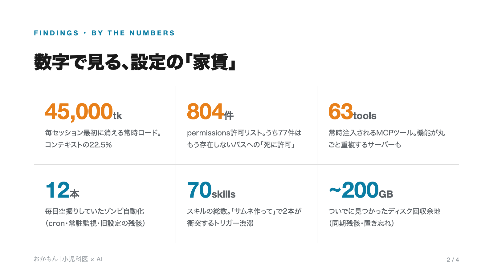
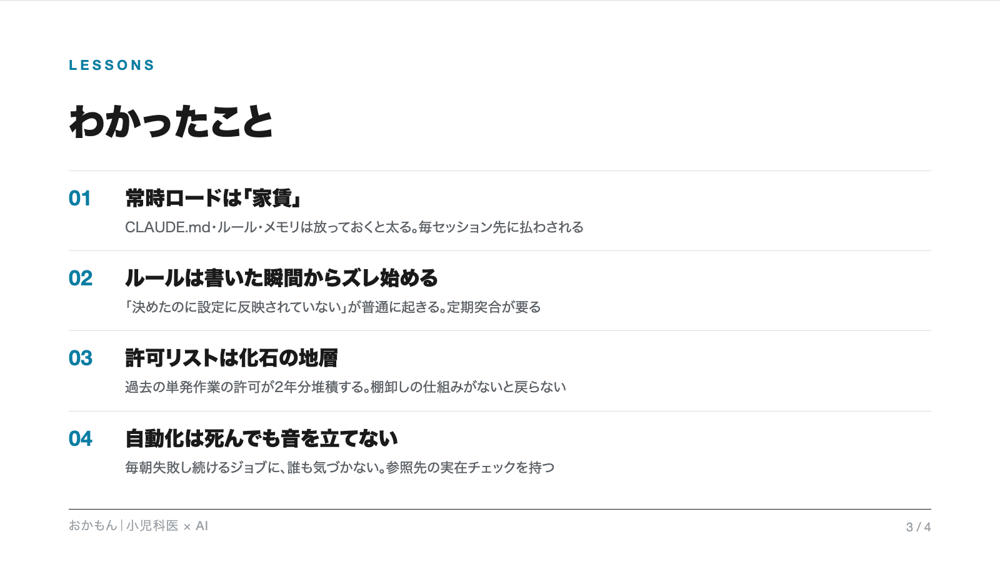

<div align="center">


[English](README.md) | **日本語**

[](LICENSE)
[](https://github.com/kgraph57/claude-code-doctor/pulls)
[](https://claude.com/claude-code)
[](https://github.com/kgraph57/claude-code-doctor/stargazers)

<h3>2年使い込んだClaude Code環境を、Claude自身に監査させた。<br>返ってきた指摘は104件。</h3>

*現役の医師が作った、Claude Code環境の健康診断。*

</div>

---

## なぜ作ったか

Claude Codeの環境は庭のように育ちます。足したスキル、承認した許可、試したMCPサーバーはすべて残り続け、誰も振り返りません。2年使い込んだ自分の環境をread-onlyで監査させたら、こうなりました。

| 項目 | 実測 |
|------|------|
| **毎セッション**最初に読み込まれる常時ロード | **45,000トークン**（コンテキストの22.5%が仕事の前に消える） |
| permissions許可リスト | **804件**、うち77件はもう存在しないパスへの「死に許可」 |
| 毎セッション注入されるMCPツール | **63個**、機能が丸ごと重複するサーバー込み |
| 毎朝空振りし続けていたゾンビ自動化 | **12本** |
| トリガー語が衝突するスキル | **70本**の中に複数クラスタ |
| ついでに見つかったディスク回収余地 | **約200GB** |

あなたの環境は違う数字のはずです。それこそがポイントで、見てみるまで分かりません。このスキルは「見てみる」を安く・安全に・ちょっと楽しくします。

## 仕組み


核心はひとつの分離です。**診断は完全read-only、治療はあなたが1個ずつ承認してから。** 網羅は安いモデルの並列で、判断は上位モデルの1本で、決定はあなたの手元に残ります。

## クイックスタート

```bash
git clone https://github.com/kgraph57/claude-code-doctor.git
ln -s "$(pwd)/claude-code-doctor" ~/.claude/skills/claude-code-doctor
```

Claude Code内で:

```text
read-onlyで私のClaude Code環境を監査して。承認前に変更禁止。
```

または `/doctor`。スキャン範囲と**立入禁止パス**（個人文書・鍵・患者データなど、AIに読ませたくない場所）を先に確認してから走ります。

> 必要環境: 監査とMarkdownレポートは追加依存なし。HTMLダッシュボードはPython標準ライブラリのみ。共有カードPNG（任意機能）だけheadless ChromeとPillowが必要。

## 何が得られるか

**1枚のHTMLダッシュボード**。数字サマリ、あなたにしか決められない決定事項（OPTION A/B形式）、影響度×工数マトリクス、段階的修復プラン、全指摘の折りたたみ表示（事実＋提案のペア）:


**サニタイズ済み共有カード**（任意）。パスを漏らさずに診断結果を自慢できます。実パスの自動マスク付き:

<p align="center">


</p>

## 何をチェックするか

10領域それぞれに明示的なチェックリストがあり、スキャン前に確認（拒否）できます。完全な定義は [`references/domains.md`](references/domains.md):

| # | 領域 | 見つけるものの例 |
|---|------|------------------|
| 1 | ディレクトリ構造 | ホーム直下に何年も置かれたファイル、死んだ隠しフォルダ、Desktop/Downloadsの滞留 |
| 2 | 開発リポジトリ | 野良リポ、肥大した.git、ネスト/循環クローン、CI不在 |
| 3 | CLAUDE.md階層 | 常時ロードのトークン税（数値で）、重複、日付付き記述の陳腐化 |
| 4 | settings・permissions | 死に許可、平文の資格情報、ガードレールの空白、スコープなしルール |
| 5 | スキル | トリガー語の衝突、誤発火しやすいdescription、肥大した単一ファイル |
| 6 | コマンド | スキルと分岐した二重管理、同名別機能 |
| 7 | サブエージェント | model未指定（静かなコスト漏れ）、レビュー役のWrite保持、休眠チーム |
| 8 | MCP・プラグイン | セッション毎のツール税、重複サーバー、ゴースト設定、死にポート |
| 9 | 自動化・Git | 消滅パスを参照するcron/launchdゾンビ、ローテなしログ、staleブランチ |
| 10 | 利用実態・ディスク | 旧パスのトランスクリプト遺物、スキル内のnode_modules、肥大セッション |

## 安全設計

- **プロンプト契約でread-only** ── 変更禁止を全サブエージェントに焼き込み
- **立入禁止パス** ── 指定フォルダは読み取りもfind走査もしない
- **秘密情報は引用しない** ── パスと存在の指摘のみ
- **削除はしない** ── 修復はMANIFEST付き隔離。削除は後日
- **データは外に出ない** ── テレメトリなし・アップロードなし。共有カードはオプトインかつサニタイズ済み
- 修復中に権限ガードにブロックされたら、迂回せず停止して報告

## 焼き込まれた設計原則

このリポ自体が、Claude Codeでフロンティアモデルを使い倒すベストプラクティスの実装例です。詳細は [docs/best-practices.ja.md](docs/best-practices.ja.md)（[English](docs/best-practices.md)）:

1. 仕事の形を決めてからモデルを撃つ
2. read-only並列ファンアウト＋上位モデルでの統合
3. 構造化出力の強制
4. 診断と治療の分離（決めるのはユーザー）
5. 成果物は「見せられる形」まで。レンダリング検証してから完成と言う
6. 常時ロードは家賃。測ってから削る

## FAQ

<details>
<summary><b>マシンに変更を加えますか？</b></summary>
診断中は加えません。監査が書くのは、事前に承認された場所へのレポート1ファイルだけです。修復は1件ずつ明示承認の後、バックアップと隔離（削除ではなく）で進みます。
</details>

<details>
<summary><b>データはどこかに送られますか？</b></summary>
いいえ。すべてあなたのClaude Codeセッション内でローカルに動きます。共有カードはオプトイン機能で、集計値だけをサニタイズして出します。
</details>

<details>
<summary><b>どれくらい時間がかかりますか？</b></summary>
最初の患者（2年物のヘビーな環境）は並列サブエージェント10体で約12分でした。逐次フォールバックはもう少しかかります。
</details>

## ロードマップ

- [ ] 健康スコア（0〜100点）とグレード表示
- [ ] Windows / Linux対応（現在はmacOS最適化）
- [ ] 差分モード: 前回の健診との比較
- [ ] CIモード: 常時ロード税が予算を超えたらPRを落とす

IssueもPRも歓迎です（日本語・英語どちらでも）。

## Star History

[](https://star-history.com/#kgraph57/claude-code-doctor&Date)

トークンとお金と週末の掃除時間が浮いたら、⭐で次の人に教えてあげてください。

## ライセンス

[MIT](LICENSE) ── © 2026 [Ken Okamoto](https://github.com/kgraph57)（小児科医 × AI、東京）
