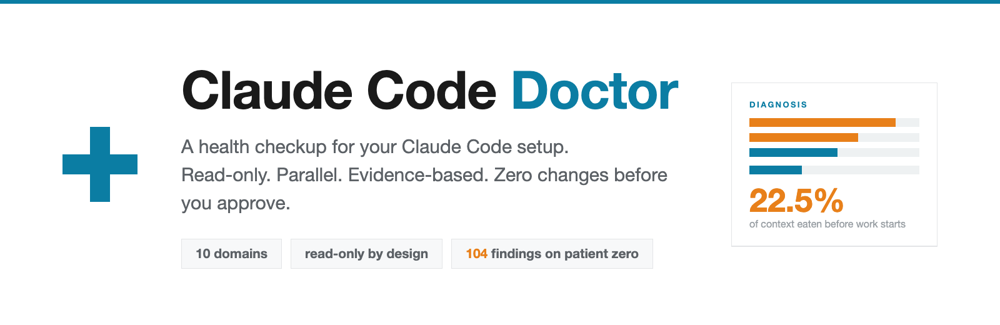
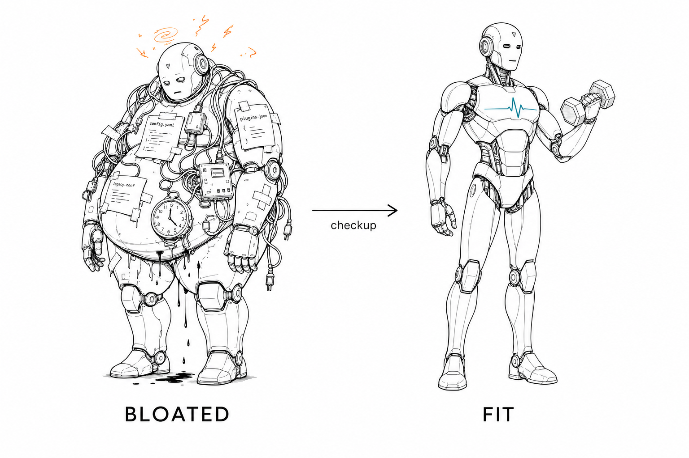
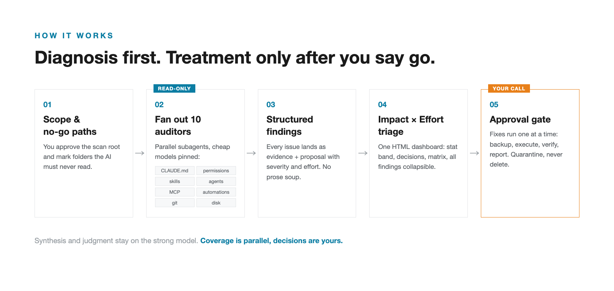
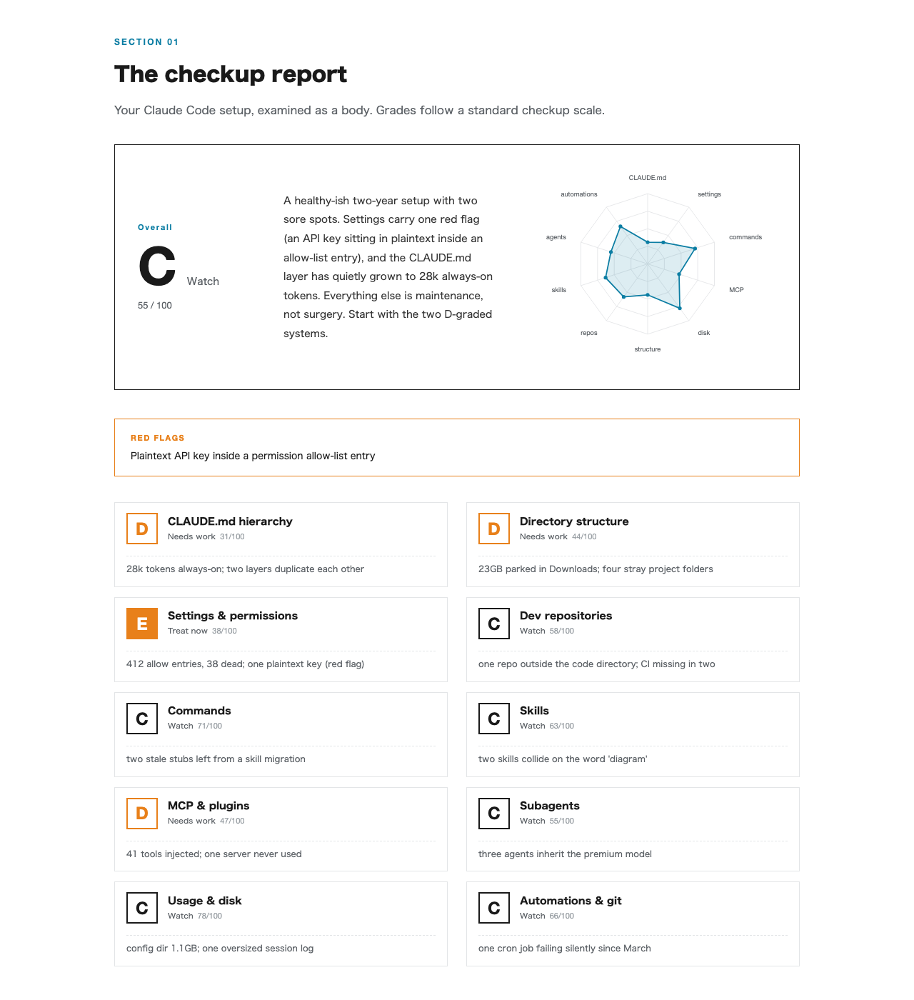
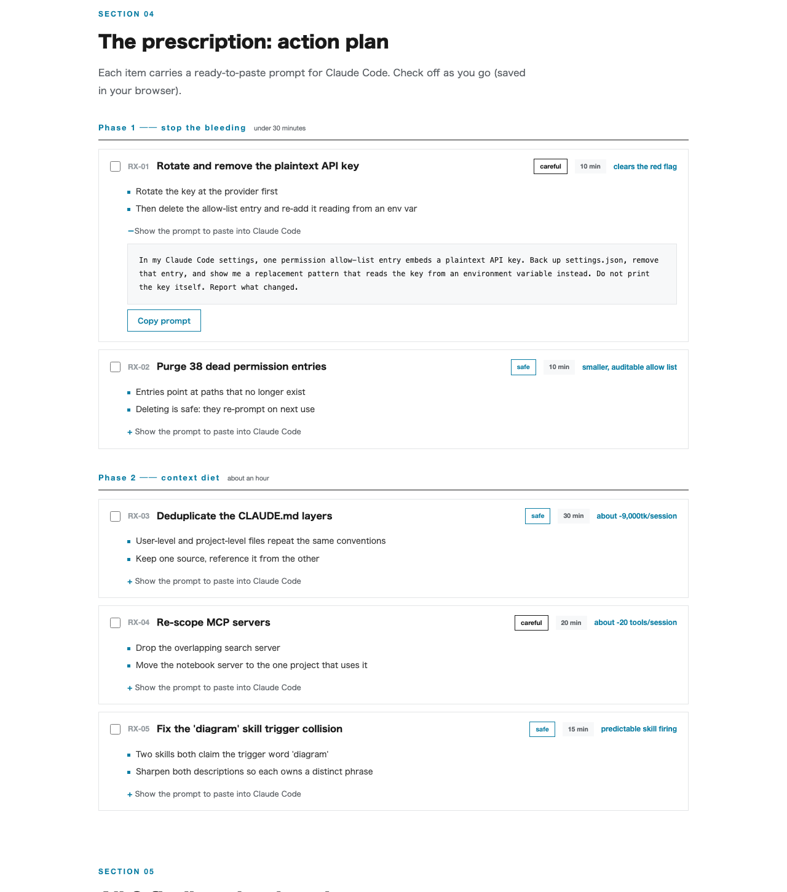
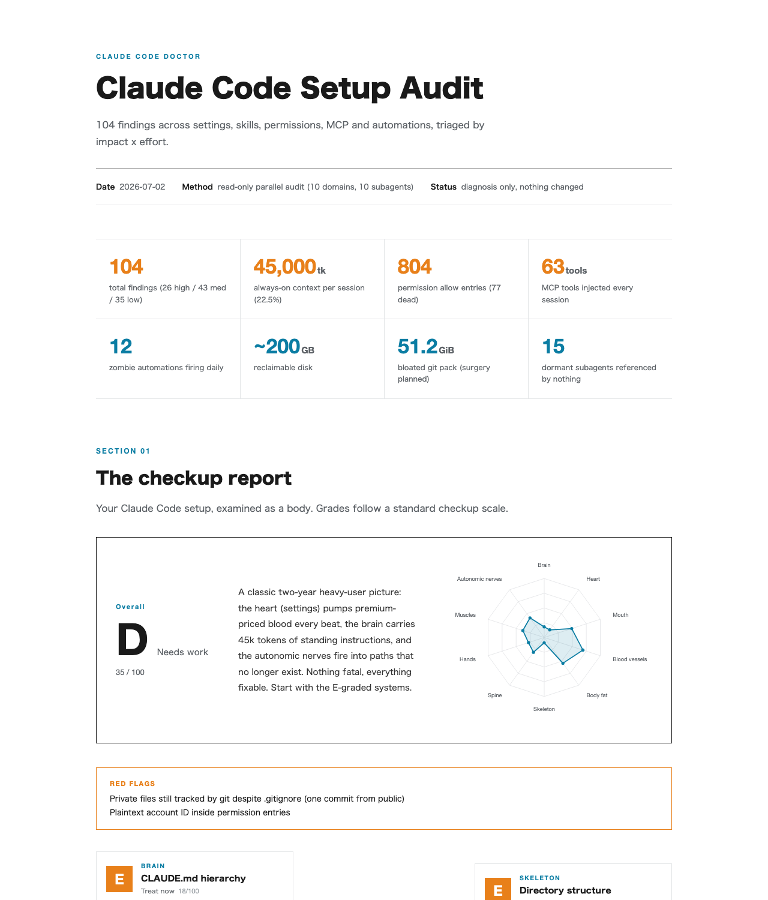
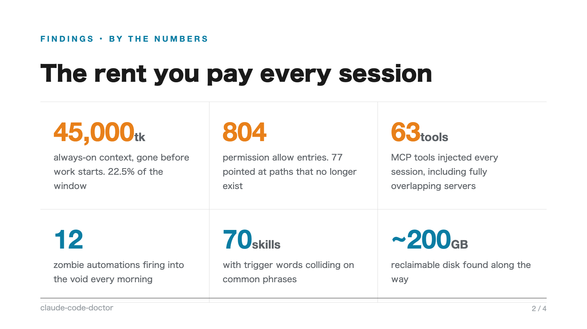
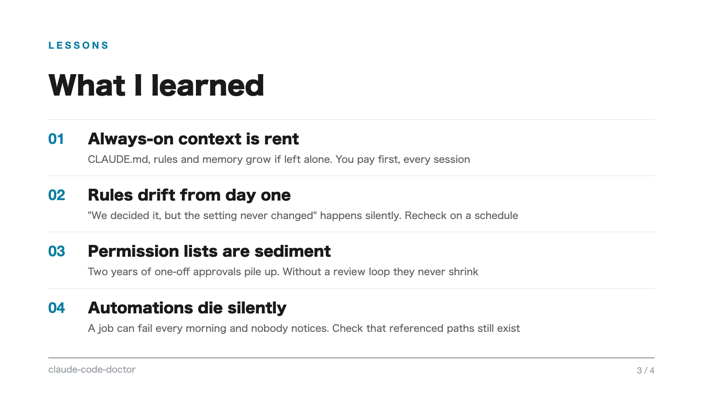

> 🇯🇵 **日本語版READMEがあります** → [README.ja.md](README.ja.md)

<div align="center">



**English** | [日本語](README.ja.md)

[](LICENSE)
[](https://github.com/kgraph57/claude-code-doctor/pulls)
[](https://github.com/kgraph57/claude-code-doctor/actions/workflows/test.yml)
[](https://claude.com/claude-code)

<h3>I let Claude Code audit its own setup.<br>It came back with 104 findings.</h3>

*Find the context tax, dead permissions, MCP bloat, and zombie automations hiding in your Claude Code setup.*

Current release: **v0.11.0** — Contributed Report validation, Linux beta probe plan, 60-second walkthrough generator, Windows beta probe plan, Cross-Harness Checkups, Community Domain Packs, CI Budget Gate, and Diff Mode. See [CHANGELOG.md](CHANGELOG.md).

</div>

---

## The 104-Finding Checkup

Claude Code Doctor is a read-only checkup for the AI-workspace layer: the
context, permissions, tools, skills, automations, and evidence trails that shape
what your coding agent sees before it writes a single line. Patient zero was my
own two-year Claude Code setup:

| What | Found |
|------|-------|
| Always-on context loaded **every session** | **45,000 tokens** (22.5% of the window, gone before work starts) |
| Permission allow-list entries | **804**, of which 77 pointed at paths that no longer exist |
| MCP tools injected every session | **63**, including two servers that fully overlap |
| Zombie automations failing silently every morning | **12** |
| Skills with colliding trigger words | several clusters across **70** skills |
| Reclaimable disk found along the way | **~200 GB** |

Your setup is different. That's the point. Linters audit your code; this audits
the environment that tells your AI what "normal" is.

## Paste This Into Claude Code

Use this if you want the safest first run:

```text
I want to run Claude Code Doctor as a read-only setup audit.
First confirm the scan scope, no-go paths, and exactly one report destination.
Do not change files, settings, git state, automations, permissions, or secrets before I approve.
Then run the 10-domain audit, produce the Markdown report, render the HTML dashboard, and give me matrix-A/B prescriptions.
```

Short form:

```text
audit my claude code setup, read-only. no changes before I approve.
```

or simply `/doctor`.

## Demo In 10 Seconds

Preview the renderer without scanning your machine:

```bash
python3 scripts/build_dashboard.py samples/dashboard.json /tmp/claude-code-doctor-dashboard.html
open /tmp/claude-code-doctor-dashboard.html
```

Generate sanitized share-card PNGs from fictional fixture data:

```bash
python3 scripts/build_share_cards.py samples/share-cards.json /tmp/claude-code-doctor-cards/
open /tmp/claude-code-doctor-cards/
```

All sample data is fictional. Your real report is generated locally and never
leaves your machine.

## 60-Second Walkthrough

Generate a short narration script and HTML capture surface:

```bash
python3 scripts/build_walkthrough.py docs/generated-demo
open docs/generated-demo/demo-walkthrough.html
```

The script is also available as [docs/walkthrough.md](docs/walkthrough.md).

## Diff Mode

The real point of a checkup is the next checkup. Compare two exported reports:

```bash
python3 scripts/compare_reports.py samples/diff-before.json samples/diff-after.json /tmp/claude-code-doctor-diff.md
open /tmp/claude-code-doctor-diff.md
```

The diff report shows score deltas, always-on token drift, permission drift,
MCP tool drift, resolved/new red flags, finding movement, and prescription
progress.

## CI Budget Gate

Fail CI when a sanitized report exceeds your team budget:

```bash
python3 scripts/check_budgets.py samples/diff-before.json samples/budgets.json /tmp/claude-code-doctor-budget.md
open /tmp/claude-code-doctor-budget.md
```

Budgets can cap always-on tokens, permission entries, MCP tools, and critical
findings. See [docs/ci-budget-gate.md](docs/ci-budget-gate.md).

## Contributed Reports

Validate sanitized real-world grade reports before posting them publicly:

```bash
python3 scripts/validate_contributed_report.py samples/contributed-report.json
```

The validator accepts aggregate metrics only and rejects raw paths, emails, and
secret-shaped strings. See [docs/contributed-reports.md](docs/contributed-reports.md).

## Community Domain Packs

Validate optional read-only check packs before using or contributing them:

```bash
python3 scripts/validate_domain_pack.py domain-packs/security-team.md
python3 scripts/validate_domain_pack.py domain-packs/*.md
```

Included packs cover security teams, solo founders, teaching workshops, and
locked-down enterprise environments. See [docs/domain-packs.md](docs/domain-packs.md).

## Cross-Harness Checkups

Validate adapter notes for Claude Code, Codex, Cursor, and OpenCode-style workbenches:

```bash
python3 scripts/validate_adapter_notes.py docs/adapters/*.md
```

Adapters keep the same vocabulary for context tax, permission drift, tool tax,
automation drift, red flags, and prescriptions. See [docs/cross-harness.md](docs/cross-harness.md).

## Linux Beta

Generate a reviewable read-only shell plan before scanning Linux or WSL:

```bash
python3 scripts/build_linux_probe_plan.py /tmp/claude-code-doctor-linux.md
open /tmp/claude-code-doctor-linux.md
```

The plan maps all 10 domains to Linux-safe probes such as `find`, `du`,
`crontab -l`, `systemctl --user list-timers`, and `ss -ltnp`. See
[docs/linux.md](docs/linux.md).

## Windows Beta

Generate a reviewable read-only PowerShell plan before scanning Windows:

```bash
python3 scripts/build_windows_probe_plan.py /tmp/claude-code-doctor-windows.md
open /tmp/claude-code-doctor-windows.md
```

The plan maps all 10 domains to Windows-safe probes such as `Get-ChildItem`,
`Get-ScheduledTask`, and `schtasks /Query`. See [docs/windows.md](docs/windows.md).

## Quick Start

```bash
git clone https://github.com/kgraph57/claude-code-doctor.git ~/.claude/skills/claude-code-doctor
```

One command: cloning straight into your skills directory is the whole install
(`~/.claude/skills/` exists on any machine where Claude Code has run; prefer
keeping repos elsewhere? clone anywhere and symlink instead).

> Requirements: none for the audit and Markdown report. The HTML dashboard uses only the Python standard library. Share-card PNGs (optional) need headless Chrome/Chromium + Pillow.
>
> **Linux**: beta coverage is available as a read-only shell probe plan — see [docs/linux.md](docs/linux.md). Domain 9 swaps launchd for cron/systemd timers, and `plutil` checks are macOS-only. Share cards work with Chromium. **Windows**: beta coverage is available as a read-only PowerShell probe plan — see [docs/windows.md](docs/windows.md).

## Why Star This Repo?

Star it if you want this to become the standard safety layer for agentic coding
setups:

- **Monthly checkups**: run the same audit repeatedly, like an annual physical for your AI workspace
- **Diff mode**: compare your current setup against the last checkup and prove the cleanup worked — shipped in v0.4.0
- **CI budget gates**: fail a PR when always-on context, permissions, or tool tax drifts past a budget — shipped in v0.5.0
- **Community domain packs**: add checks for teams, frameworks, OSes, and security policies without forking the core skill — shipped in v0.6.0
- **Cross-harness checkups**: adapt the same protocol to Claude Code, Codex, Cursor, and other agent workbenches — shipped in v0.7.0

See the full build path in [docs/roadmap.md](docs/roadmap.md).

## Why this exists

Claude Code setups grow like gardens. Every skill you add, every permission you
approve, every MCP server you try stays behind — and nobody ever looks back. An
unhealthy setup means an unhealthy AI: bloated with config it drags into every
session, slow to start, prone to weird moves. You are raising this thing — keep
it fit.

<p align="center">

</p>

## How it works



The whole trick is one separation: **diagnosis is strictly read-only, treatment happens only after you approve each fix.** Coverage comes from cheap models fanned out in parallel; judgment stays on the strong model; decisions stay with you.

## What you get

All report screenshots below show **fictional sample data** — your report is generated locally from your own machine and never leaves it.

**A checkup report, like the one from your annual physical.** Each of the ten domains gets a 0-100 score and an A-E grade (A "healthy" through E "treat now"), plotted on a 10-axis radar chart. An optional body-map mode adds the organ metaphor (CLAUDE.md as the brain, settings as the heart) for shareable reports — plain domain names by default. Critical dangers — plaintext credentials, private files tracked by git — are **red flags** that force a failing grade no matter the arithmetic. The scoring model is fully documented in [`references/scoring.md`](references/scoring.md):



**A prescription, not just a diagnosis.** Every fix ships as an action card: risk level (safe / careful / surgery), time estimate, expected effect, and a **ready-to-paste prompt** — copy it into Claude Code and exactly that one fix runs, with backup and quarantine baked in. Checkboxes persist in your browser, so the report doubles as your progress tracker:



**A one-page HTML dashboard** — stat band, the decisions only you can make (as OPTION A/B), an impact-x-effort matrix, a phased fix plan, and every finding as collapsible evidence + proposal:



**Sanitized share cards** (optional) — brag about your findings without leaking your paths. Generated by the same scripts, with automatic path masking:

<p align="center">


</p>

## What gets checked

Ten domains, each with an explicit checklist you can review (and veto) before the scan — full definitions in [`references/domains.md`](references/domains.md):

| # | Domain | Examples of what it looks for |
|---|--------|-------------------------------|
| 1 | Directory structure | files parked in `~/` for years, dead dot-folders, Desktop/Downloads backlog |
| 2 | Dev repositories | stray repos, bloated `.git` packs, nested/circular clones, missing CI |
| 3 | CLAUDE.md hierarchy | the always-on token tax (as a number), duplication, stale dated notes |
| 4 | Settings & permissions | dead allow entries, plaintext credentials, guardrail gaps, unscoped rules |
| 5 | Skills | trigger-word collisions, misfire-prone descriptions, oversized single files |
| 6 | Commands | command/skill duplicates that diverged, same name with different behavior |
| 7 | Subagents | unpinned models (silent cost leak), reviewers holding Write access, dormant teams |
| 8 | MCP & plugins | per-session tool tax, overlapping servers, ghost configs, dead ports |
| 9 | Automations & git | cron/launchd zombies pointing at vanished paths, unrotated logs, stale branches |
| 10 | Usage & disk | transcript remains, node_modules inside skills, oversized sessions |

## Safety by design

- **Read-only by prompt contract** — the mutation ban is baked into every subagent prompt. Be clear about what that means: it is an instruction-level contract, not an OS sandbox. For hard guarantees, pair it with Claude Code permission deny rules; the skill treats a firing guard as a stop signal, never something to route around
- **No-go paths** — folders you designate are never read, not even traversed
- **Secrets are never quoted** — path and existence only
- **Nothing is deleted** — fixes quarantine files with a manifest; deletion comes weeks later
- **Nothing leaves your machine** — no telemetry, no uploads; share cards are opt-in and sanitized (emails, API-key shapes, tokens, UUIDs and user paths auto-masked, and rendering **fails closed** if anything secret-shaped survives). The masking is a seatbelt, not a guarantee — glance at a card before you post it
- If a permission guard blocks a fix, the skill stops and reports instead of routing around it

## The philosophy

An AI workspace checkup is not a cleanup script. It is a clinical protocol for
trustworthy delegation: measure the hidden context, permissions, tools,
automations and evidence trails that shape what your AI does before you let it
act. The short version is: **diagnose first, treat only after consent, and make
every finding inspectable.** See
[`docs/ai-checkup-philosophy.md`](docs/ai-checkup-philosophy.md).

## The principles baked in

This repo doubles as a working example of frontier-model best practices in Claude Code — built with and battle-tested on **Claude Fable 5** and **Opus 4.8**, and a good first thing to run if you just got Fable 5 access and wonder where your context budget goes. See [docs/best-practices.md](docs/best-practices.md):

1. Decide the shape of the work before you fire the model
2. Read-only parallel fan-out, top-tier synthesis
3. Force structured output
4. Separate diagnosis from treatment (user sovereignty)
5. Carry deliverables to "showable" — and verify rendering before calling it done
6. Always-on context is rent: measure it, then cut it

## FAQ

<details>
<summary><b>Does it change anything on my machine?</b></summary>
Not during diagnosis. The audit writes exactly one report file, to a location you approve first. Fixes run only after you explicitly approve each one, with backups and quarantine instead of deletion.
</details>

<details>
<summary><b>Does my data go anywhere?</b></summary>
No. Everything runs locally through your own Claude Code session. The share cards are an opt-in feature, and they sanitize aggregates only.
</details>

<details>
<summary><b>How long does it take?</b></summary>
Patient zero (a two-year-old heavy setup) took about 12 minutes with 10 parallel subagents. Sequential fallback takes longer.
</details>

<details>
<summary><b>What does the audit itself cost?</b></summary>
Patient zero (a two-year heavy setup, 10 parallel subagents) consumed roughly one million tokens end to end — a few dollars at API prices, or a meaningful chunk of a subscription session. The sequential fallback spends less at once but takes longer. A tool that flags your cost leaks should disclose its own price tag.
</details>

<details>
<summary><b>Can I run it in a locked-down corporate environment?</b></summary>
Everything runs locally inside your own Claude Code session; the skill adds no network calls and no telemetry of its own. It respects your permission settings — if your deny rules block a probe, the auditor reports the gap instead of working around it.
</details>

<details>
<summary><b>Does it work in Japanese?</b></summary>
Yes — reports and the dashboard follow your language (<code>meta.lang: "en" | "ja"</code>). The skill itself is bilingual-triggered.
</details>

## Roadmap

- [x] Health score (0-100), A-E grades, radar chart, red flags — shipped
- [x] 60-second walkthrough generator and capture page — shipped
- [x] Diff mode: compare against your last checkup (the real point of a checkup) — shipped
- [x] Contributed report validator: share real grades without leaking raw paths — shipped
- [x] Linux path coverage beta: read-only shell probe plan — shipped
- [x] Windows path coverage beta: read-only PowerShell probe plan — shipped
- [x] CI mode: fail a PR when the always-on token tax crosses a budget — shipped
- [x] Community domain packs: add your own checks via validated Markdown packs — shipped

Contributions welcome — issues and PRs, in English or Japanese. See [CONTRIBUTING.md](CONTRIBUTING.md).

## If this helped

If it saved you tokens, money, or a weekend of cleanup, a ⭐ helps other people find it — and an issue with your overall grade helps calibrate the scoring model.

## License

[MIT](LICENSE) — © 2026 [Ken Okamoto](https://github.com/kgraph57), pediatrician & AI builder, Tokyo.
